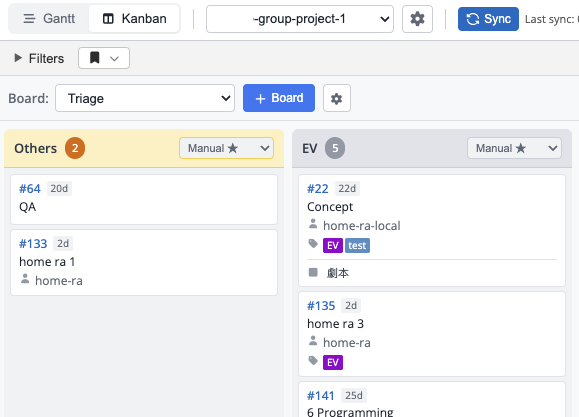
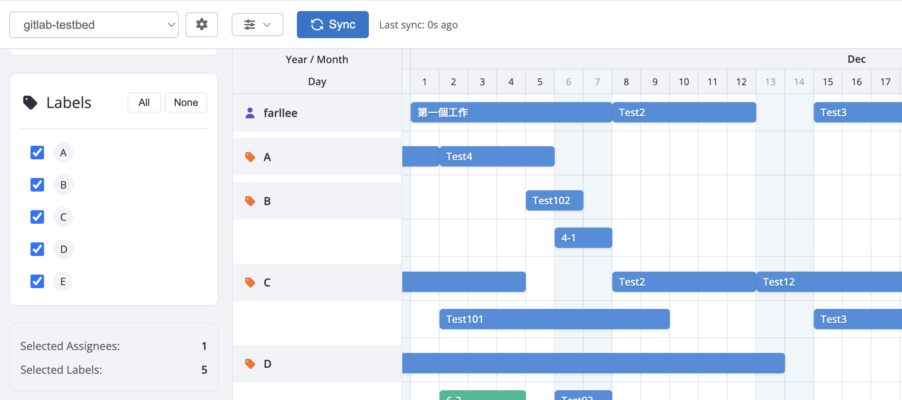

# React Gantt Chart

A data-source-agnostic Gantt chart component for React. Supports multiple data backends through a pluggable provider interface, with a built-in Azure DevOps demo data set.

- https://farl.github.io/react-gantt-gitlab

## Features

### Supported Data Sources

- **Azure DevOps** - Demo data included for quick evaluation
- **Custom Providers** - Extensible `DataProviderInterface` for any data source
- **Pluggable Architecture** - Add new backends by implementing the provider contract

<!-- Screenshot placeholder: add a gantt-chart.png to ./assets/ -->

### How to Start

1. Run `npm install` and then `npm run dev`
2. Open the demo in your browser
3. Use the **+Add** button to add a new project configuration
   - Select the data source type
   - Configure credentials (if required by the provider)
   - Test the connection and save
4. The chart will sync and display tasks from the configured data source

### Core Features

- **Project Configuration**
  - Configure base URL and access tokens for your data source
  - Set up holidays and special working days (stored as provider snippets)
- **Filtering**
  - Simple filter panel for tasks and milestones
- **Milestone Management**
  - Create, edit, and delete milestones
  - Click + next to a milestone to add a child issue
- **Issue / Task Management**
  - Create, edit, and delete issues and tasks
  - Click + next to an issue to add a child task
  - Batch creation supported
- **Inline Editing**
  - Double-click a milestone, issue, or task to open the editor
  - Link to the original data source page from the editor
- **Sorting**
  - Drag-and-drop reordering of issues and tasks
  - Ordering syncs back to the data source
- **Timeline Adjustments**
  - Drag timeline bars to adjust milestone, issue, and task dates
- **Task Links**
  - Click the circles on either side of a timeline bar to create links between tasks
  - Delete or modify links from the editor
- **Time Scale**
  - Adjustable time units (day, week, month)
- **Server / Client Filters**
  - Server-side filters reduce data load for large projects
- **Color Rules**
  - Define color rules based on title or label to display colored stripes on timeline bars (up to three colors)
  - Rules are stored in the project configuration
- **Custom Grid Columns**
  - Choose and reorder columns: Issue ID, Start, Due, Assignee, Weight, Workdays, Iteration, Epic, Labels, Order
- **Blueprints (Templates)**
  - Save a milestone with all its issues, tasks, and relationships as a reusable template
  - Auto-prefix issue names and preserve durations
  - Store locally or share via provider snippets
- **Batch Operations**
  - Multi-select tasks (Shift/Ctrl+click), then right-click > Move In to reassign milestone, parent issue, or epic
- **Drag-to-Create**
  - Drag on the timeline to create a new task bar directly
- **Off-screen Indicators**
  - Arrows point to tasks outside the visible area; click to scroll to them

### Known Issues

- Newly created items inside a milestone may take a moment to appear after sync
- Drag-and-drop between milestones / issues is not yet supported

## Kanban View

### Features

- Kanban boards stored as provider snippets
- Board lists support drag-and-drop reordering

## Workload View

- Open from the sidebar
- Filter by assignee and labels to visualize workload
- Adjustable time range
- Drag tasks between assignees or label groups
- Enable "Other" in settings to see unassigned work

## Acknowledgements

- This project is based on [SVAR React Gantt](https://svar.dev/react/gantt/)
